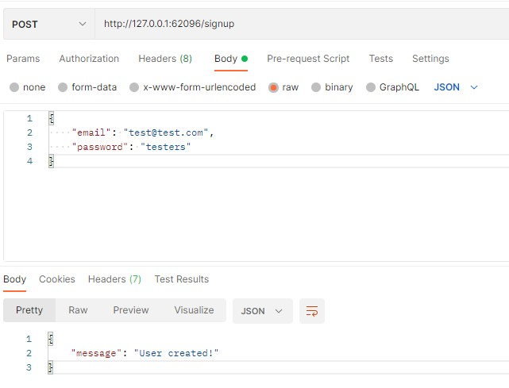
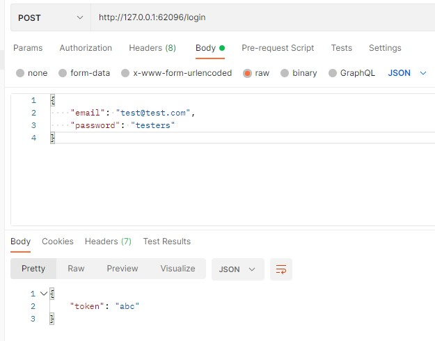

# Alison Vandromme - Ynov M1 Docker Elective
Kubernetes - V3

<i>Note: 

V1 & V2 were mostly to learn the basic concepts of Kubernetes.
I didn't want to modify them as I'd like to keep the learning steps available. 
Hence, the multiple repos.
</i>

## App description

- Users-API: Creates users and Logs users 
- Auth-API: Generate and verify tokens for authenticated users
- Task-API: Stores users tasks in a file and received a token to be verified

<i>Note: Dummy data, there is no database (so far)</i>

## Stack 

     

## Architecture


## Method used

### Step 1: Node/Express Apps

- Created user-API
- Created auth-API
- Created tasks-API
- Tested each app individually with npm start and Postman
### Step 2: Dockerized APIs

- Created Dockerfile for each API
- Created docker-compose
- Replaced API url with docker network name
- Tested with : 

```sh
docker-compose up --build
```

<i>Note: Didn't add volumes, I want to focus on containers and pods interactions</i>

### Step 3: Deployment & Service Creation for User API

- Verify that Minikube is up and running with

```sh
minikube status
```

- If it's not running, then : 

```sh
minikube start
```

- Check if there is no ungoing deployments or services

```sh
kubectl get deployments
kubectl get services
```

- Modified users-app.js so it doesn't make any requests for now to auth-api
- Built image and pushed it to DockerHub

```sh
docker build -t alisonv2/kub-v3-users .
docker push alisonv2/kub-v3-users
```

- Created users-deployment.yaml and applied it
- Verify that pod is up and running
- Created users-service.yaml and applied it
- Expose service with Minikube
- Tested the service with Postman at {minikube-url}/login (passing email and password)

```sh
cd ..
cd kubernetes
kubectl apply -f users-deployment.yaml
kubectl get pods
kubectl apply -f users-service.yaml
minikube service users-service
```

### Step 4: Deployment & Service Creation for Auth API

- Reverted users-api code so it does send requests to the auth-api
- Replaced API urls with environment variables so the exact url used can be changed depending on which environment we're running
- Added environment to docker-compose
- Built new image only for auth and pushed it to DockerHub

```sh
cd auth-api
docker build -t alisonv2/kub-v3-auth .
docker push alisonv2/kub-v3-auth
```

- Created auth-deployment inside users-deployment so it doesn't create another pod. The goal is to have auth and users as two different containers inside the same pod.
- Updated users image

```sh
cd ..
cd users-api
docker build -t alisonv2/kub-v3-users .
docker push alisonv2/kub-v3-users
```

- Provide AUTH_ADDRESS for Pod-internal communication
- Applied updated users-deployment
- Check if both containers are running (should see 2/2 Running and 1/1 Terminating)

```sh
cd ..
cd kubernetes
kubectl apply -f users-deployment.yaml
```

- Signup test with Postman: Tests the users-api



- Login test with Postman: Tests users/auth APIs communication, as the token is created in the auth-api



### Step 5: Users-deployment and auth-deployment Separation

- Created auth-deployment.yaml
- Created auth-service.yaml
- Chosed ClusterIP as a service type so the auth-api is not exposed outside the cluster
- Modified get adress in users-app.js to used env variables provided by kubernetes (ALLCAPSSERVICENAME_SERVICE_SERVICE_HOST)
- Added the same env name to docker-compose
- Modified env in users-deployment
- Applied auth-deployment and service
- Reapplied users-deployment (As the file didn't change, I deleted the currently running one so the new one is applied.)
- Checked if pods are up and running

<i>Note: 
I kept the manually set env variable for the first call, so I can have both options as a reminder.

- Option 1: Native env variables created by kubernetes

```env
process.env.NAME_SERVICE_SERVICE_HOST
```

- Option 2: CoreDNS for automatic domain names

```yaml
value: "servicename.namespace"
```
The namespaces are available with

```sh
kubectl get namespaces
```
</i>

```sh
# Make sure you're in users-api folder
docker build -t alisonv2/kub-v3-users .
docker push alisonv2/kub-v3-users
cd ..
cd kubernetes
kubectl apply -f auth-service.yaml,auth-deployment.yaml
kubectl delete -f users-deployment.yaml
kubectl apply -f users-deployment.yaml
kubectl get pods
```

- Tested with Postman

### Step 6: Pod to pod communication with DNS


