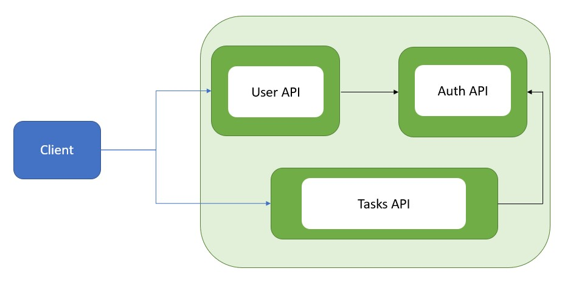

# Alison Vandromme - Ynov M1 Docker Elective
Kubernetes - V3

<i>Note: 

V1 & V2 were mostly to learn the basic concepts of Kubernetes.
I didn't want to modify them as I'd like to keep the learning steps available. 
Hence, the multiple repos.
</i>

## App description

- Users-API: Creates users and Logs users 
- Auth-API: Generate and verify tokens for authenticated users
- Task-API: Stores users tasks in a file and received a token to be verified

<i>Note: Dummy data, there is no database (so far)</i>

## Architecture



## Stack 

     

## Method used

### Step 1: Node/Express Apps

- Created user-API
- Created auth-API
- Created tasks-API
- Tested each app individually with npm start and Postman
### Step 2: Dockerized APIs

- Created Dockerfile for each API
- Created docker-compose 
- Tested with : 

```sh
docker-compose up --build
```


